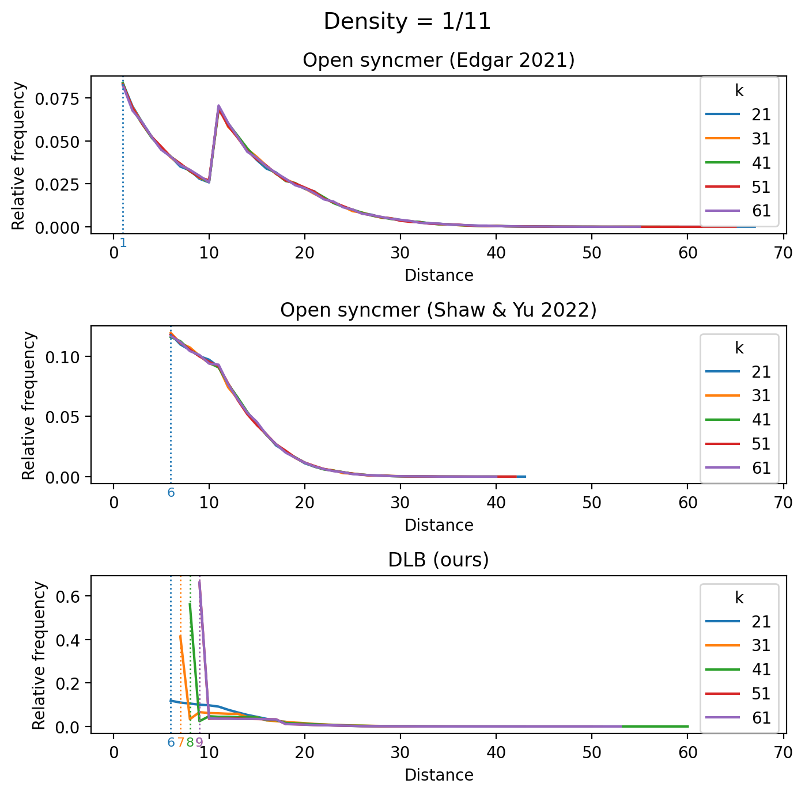

# Optimal distance lower bound k-mer sampling
Guaranteed larger distance between consecutive k-mers for the same density.

## Motivation
Given a set of $k$-mers (substrings of length $k$) derived from a long (genomic) sequence,
it is often desirable to subsample this $k$-mer set and perform computation (eg., comparing genomes, aligning reads, etc.) on these
smaller sets for reduced memory usage and runtime.

With the reasonable assumption that all $k$-mers in the sequence is unique,
the *density* of a sampling scheme is the number of sampled $k$-mers divided by the total number of $k$-mers.
In practice, density is usually fixed to be a specific based on the desired amount of subsampling.
One simple way to subsample $k$-mers is to hash each $k$-mer and pick those with hashes
(for simplicity, assume hashes are uniform between 0 and 1) less than or equal to the density.
This is commonly called the FracMinHash scheme.

An issue with the FracMinHash is that it does not enforce an upper bound or lower bound on the
distances between $k$-mers that are sampled consecutively in a long sequence.
Windowed schemes like minimizers provide a distance *upper bound* by sampling at least one $k$-mer per sliding window
in the sequence.
In this work, we examine the problem of sampling $k$-mers with a distance *lower bound*.

Our algorithm is based on *open syncmers*:
* [**Edgar (2021)**]() introduced the open syncmers scheme. A $k$-mer is sampled iff
the minimum hashed $s$-mer within the $k$-mer is at the start (position 0) of the $k$-mer.
The density of this scheme is $\frac{1}{k - s + 1}$, since there are $k - s + 1$
positions for the $s$-mer. The distance lower bound for this scheme is 1.

* [**Shaw & Yu (2022)**]() showed that the optimal position that maximizes conservation
is at the middle position: $\frac{k - s}{2}$. This also gives a distance lower bound. The intuition is as follows.
Assume that the current $k$-mer is sampled. Then the minimum $s$-mer is at the middle position.
Two events can happen that samples another $k$-mer, assuming $s$-mers are distinct:
either the minimum $s$-mer is shifted out the left side of the $k$-mer,
or a smaller minimum $s$-mer is shifted in on the right side of the $k$-mer.
Therefore, the distance lower bound is the minimum of the distance between the middle and the left and right sides
of the $k$-mer: $min(\frac{k - s}{2}, \frac{k - s}{2}) + 1$.

* [**Dutta et al. (2022)**]() proposed the concept of parameterized syncmer schemes, which generalizes
open syncmers and allows specifying a set of positions where the $k$-mer will be sampled if the
minimum $s$-mer occurs in any of those positions. Our new scheme is a parameterized syncmer scheme,
however we optimize for a different metric.

## Optimal Distance Lower Bound (DLB) k-mer sampling


## How to run
Install [Rust](https://www.rust-lang.org/tools/install), clone this repo, and then run this code using
```bash
cargo run --release --quiet > results.csv
python plot.py
```
